# Spatio-Temporal-papers
本项目包括：时空领域历年顶会/顶刊论文，相关数据集与时空领域知名专家学者信息。

This project includes: papers of the top conferences/journals in the field of Spatio-Temporal domain, relevant data sets and information of well-known experts and scholars in the field of Spatio-Temporal domain.

# Contribution

Contributions are always welcome! Make an individual pull request for each suggestion. Please follow the specification：**[contribute](./contribute.md)**.

# Content

<table>
<tr><td colspan="2"><a href="#survey-papers">1. Survey</a></td></tr> 
<tr><td colspan="2"><a href="#applications">2. Applications</a></td></tr> 
<tr>
    <td>&emsp;<a href="#traffic-prediction">2.1 Traffic Prediction</a></td>
    <td>&ensp;<a href="#flows-prediction">2.2 Flows Prediction</a></td>
</tr> 
<tr>
    <td>&emsp;<a href="#demand-prediction">2.3 Demand Prediction</a></td>
    <td>&ensp;<a href="#travel-time-or-arrive-time-prediction">2.4 Travel time or Arrive time Prediction</a></td>
</tr>
<tr><td colspan="2"><a href="#datasets">3. Datasets</a></td></tr>
<tr>
    <td>&emsp;<a href="#sensor-data">3.1 Sensor data</a></td>
    <td>&ensp;<a href="#trajectory-data">3.2 Trajectory data</a></td>
</tr> 
<tr>
    <td>&emsp;<a href="#Others">3.3 others</a></td>
</tr> 
<tr><td colspan="2"><a href="#experts">4. Experts</a></td></tr> 
</table>

# [Survey papers](#content)

[1] **Urban Computing: Concepts, Methodologies, and Applications.** ACM Transactions on Intelligent Systems and Technology 2014. [paper](https://www.microsoft.com/en-us/research/wp-content/uploads/2016/02/UrbanComputing-zheng-tist2014.pdf)

*YU ZHENG, LICIA CAPRA, OURI WOLFSON, HAI YANG*

---

[2] **Deep Learning for Spatio-Temporal Data Mining: A Survey.** IEEE Transactions on Knowledge and Data Engineering(TKDE) 2020. [paper](https://arxiv.org/pdf/1906.04928.pdf)

*Senzhang Wang, Jiannong Cao, Fellow, Philip S. Yu*

---

[3] **A Survey on Modern Deep Neural Network for Traffic Prediction: Trends, Methods and Challenges.** IEEE Transactions on Knowledge and Data Engineering(TKDE) 2020. [paper](https://ieeexplore.ieee.org/abstract/document/9112608)

*David Alexander Tedjopurnomo, Zhifeng Bao, Baihua Zheng, Farhana Murtaza Choudhury, Kai Qin*

---

[4] **How to Build a Graph-Based Deep Learning Architecture in Traffic Domain: A Survey.** arXiv 2020. [paper](https://arxiv.org/pdf/2005.11691.pdf)

*Jiexia Ye, Juanjuan Zhao, Kejiang Ye, Chengzhong Xu*

---

# [Applications](#content)

## [Traffic Prediction](#content)

本节为交通预测主题相关文章，即文中未指明特定研究主题（如速度/流量预测等），且实验部分也使用多类数据集验证的文章。

 2020 

[1] **[Spatio-Temporal Graph Structure Learning for Traffic Forecasting.](./papers/2020/AAAI/SLC/SLC)** AAAI 2020. [note](./papers/2020/AAAI/SLC/note.md)

| Models |  Modules   |                 Architecture                 | conclusion                                                   |
| :----- | :--------: | :------------------------------------------: | :----------------------------------------------------------- |
| SLC    | SLCNN, P3D | 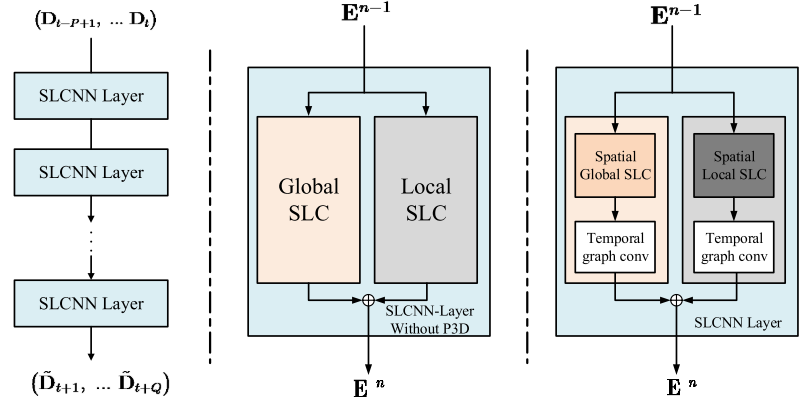 | This paper proposes a new type of graph convolution formula. **The article mentions that it is necessary to learn not only the feature information on the graph, but also the structure information of the graph**, which means that the structure of the graph changes dynamically. Use P3D to model the time dependence. |

*[Q Zhang](https://scholar.google.com.hk/citations?user=RDwnNsQAAAAJ&hl=zh-CN&oi=sra), J Chang, [G Meng](https://scholar.google.com.hk/citations?user=5hti_r0AAAAJ&hl=zh-CN&oi=sra), [S Xiang](https://scholar.google.com.hk/citations?user=0ggsACEAAAAJ&hl=zh-CN&oi=sra), C Pan*

------

[2] **[GMAN: A Graph Multi-Attention Network for Traffic Prediction](./papers/2020/AAAI/GMAN/GMAN)** AAAI 2020. [note](./papers/2020/AAAI/GMAN/note.md), [github](https://github.com/zhengchuanpan/GMAN)

| Models |                   Modules                    |                 Architecture                  | conclusion                                                   |
| :----: | :------------------------------------------: | :-------------------------------------------: | :----------------------------------------------------------- |
|  GMAN  | Encoder-Decoder,ST-Attention,Trans Attention | 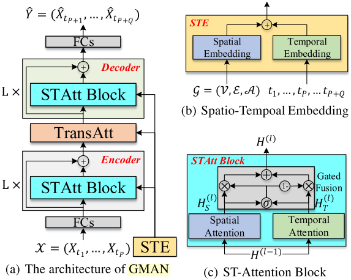 | This paper proposes a spatial-temporal attention mechanism with gated fusion to simulate complex spatial-temporal correlation. |

*[C Zheng](https://scholar.google.com.hk/citations?user=8BAMXAMAAAAJ&hl=zh-CN&oi=sra), [X Fan](https://scholar.google.com.hk/citations?user=gR7VT-4AAAAJ&hl=zh-CN&oi=sra), [C Wang](https://scholar.google.com.hk/citations?user=kAnv3SkAAAAJ&hl=zh-CN&oi=sra), [J Qi](https://scholar.google.com.hk/citations?user=mxS6eHYAAAAJ&hl=zh-CN&oi=sra)*

------

[3] [**Dynamic Graph Convolution Network for Traffic Forecasting Based on Latent Network of Laplace Matrix Estimation.**](./papers/2020/TITS/DGCN/DGCN) IEEE Transactions on Intelligent Transportation Systems(TITS) 2020. [note](./papers/2020/TITS/DGCN/note.md), [paper](https://ieeexplore.ieee.org/document/9190068)

| Models | Modules  |                  Architecture                   | conclusion                                                   |
| :----: | :------: | :---------------------------------------------: | :----------------------------------------------------------- |
|  DGCN  | TCL,GTCL | 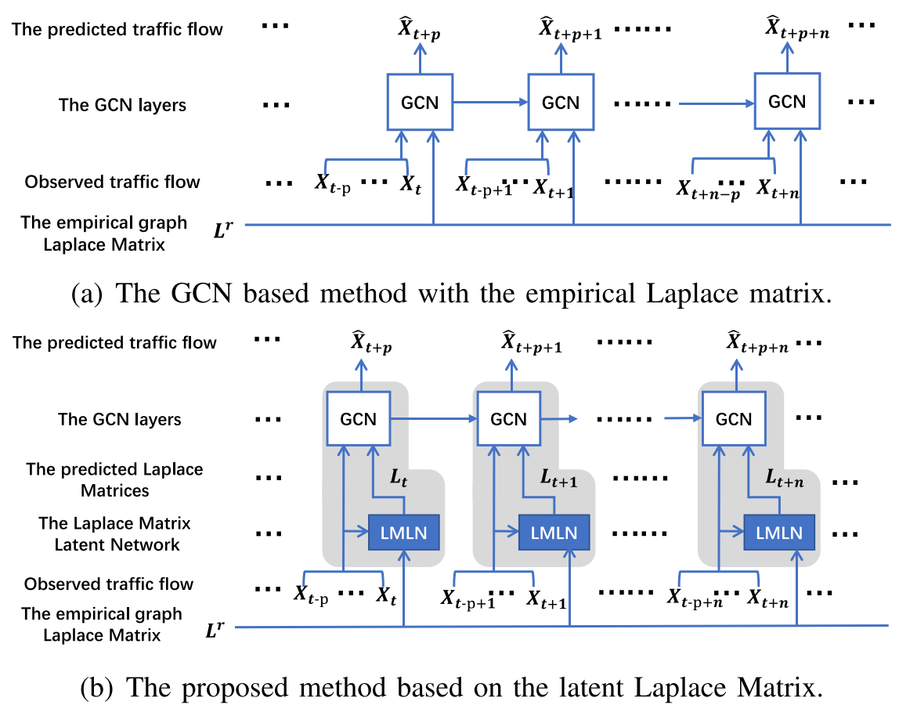 | Different from most of the current GCN based methods, which generally used empirical graph Laplace matrix in graph convolution, this paper propose a latent network to estimate the dynamic Laplace matrix adaptively, which is verified with good ability to extract spatial-temporal correlation of the traffic data. |

*K Guo, [Y Hu](https://scholar.google.com.hk/citations?user=qeG9e2AAAAAJ&hl=zh-CN&oi=sra), [Z Qian](https://scholar.google.com.hk/citations?user=i8vD3O0AAAAJ&hl=zh-CN&oi=sra), Y Sun, [J Gao](https://scholar.google.com.hk/citations?user=3-KJN8IAAAAJ&hl=zh-CN&oi=sra)*

## [Flow Prediction](#content)

 2020 

[1] **[Citywide Traffic Flow Prediction Based on Multiple Gated Spatio-temporal Convolutional Neural Networks](./papers/2020/TKDD/MGSTC/Citywide Traffic Flow Prediction Based on Multiple Gated Spatio-temporal Convolutional Neural Networks)** TKDD 2020. [note](./papers/2020/TKDD/MGSTC/note.md). 

| Models | Modules |                         Architecture                         | Highlights                                                   |
| :----: | :-----: | :----------------------------------------------------------: | :----------------------------------------------------------- |
| MGSTC  |         |  | (1) Motivated by the gate mechanism utilized in LSTM, we also propose a novel spatio-temporal gated mechanism based on CNNs. 基于LSTM中门控机制，作者提出了一种基于CNN的时空门控机制。 (2)  The MGSTC can combine the output features of the multiple gated spatio-temporal CNN branches, and assign weights to different branches dynamically. |

 *[C Chen](https://scholar.google.com/citations?user=BIQ_I9wAAAAJ&hl=zh-CN&oi=sra), [K Li](https://scholar.google.com/citations?user=yuQLgRAAAAAJ&hl=zh-CN&oi=sra), SG Teo, X Zou, [K Li](https://scholar.google.com/citations?user=x0YtT7QAAAAJ&hl=zh-CN&oi=sra), [Z Zeng](https://scholar.google.com/citations?user=ztBsejkAAAAJ&hl=zh-CN&oi=sra)*

------

[2] **[AutoST: Efficient Neural Architecture Search for Spatio-Temporal Prediction](./papers/2020/KDD/AutoST/AutoST Efficient Neural Architecture Search for Spatio-Temporal Prediction)** SIGKDD 2020. [note](./papers/2020/KDD/AutoST/note.md). 

| Models | Modules |                         Architecture                         | Highlights |
| :----: | :-----: | :----------------------------------------------------------: | :--------: |
| AutoST |         |  |            |

*T Li, [J Zhang](https://scholar.google.com/citations?user=juUcdgYAAAAJ&hl=zh-CN&oi=sra), K Bao, [Y Liang](https://scholar.google.com/citations?user=n9cODgcAAAAJ&hl=zh-CN&oi=sra)*

------

[3] **[Physical-Virtual Collaboration Modeling for Intra-and Inter-Station Metro Ridership Prediction](./papers/2020/TITS/PVCGN/PVCGN)** TITS 2020. [note](./papers/2020/TITS/PVCGN/note.md). [code](https://github.com/HCPLab-SYSU/PVCGN?utm_source=catalyzex.com). 

| Models | Modules |                         Architecture                         | Highlights |
| :----: | :-----: | :----------------------------------------------------------: | :--------: |
| PVCGN  |         |  |            |

*[L Liu](https://scholar.google.com/citations?user=sh2DmQgAAAAJ&hl=zh-CN&oi=sra), J Chen, [H Wu](https://scholar.google.com/citations?user=gX2pNewAAAAJ&hl=zh-CN&oi=sra), J Zhen*

------

[4] **[Dynamic Spatial-Temporal Representation Learning for Traffic Flow Prediction](./papers/2020/KDD/AutoST/AutoST Efficient Neural Architecture Search for Spatio-Temporal Prediction)** TITS 2020. [note](./papers/2020/TITS/ATFM/ATFM). [code](https://github.com/liulingbo918/ATFM?utm_source=catalyzex.com). 

| Models | Modules |                         Architecture                         | Highlights |
| :----: | :-----: | :----------------------------------------------------------: | :--------: |
|  ATFM  |         |  |            |

*[L Liu](https://scholar.google.com/citations?user=sh2DmQgAAAAJ&hl=zh-CN&oi=sra), J Zhen, [G Li](https://scholar.google.com/citations?user=2A2Bx2UAAAAJ&hl=zh-CN&oi=sra), G Zhan*

------

[5] **[Spatial-Temporal Convolutional Graph Attention Networks for Citywide Traffic Flow Forecasting](./papers/2020/CIKM/STCGA)** CIKM 2020. [note](./papers/2020/CIKM/STCGA/note.md). 

| Models | Modules |                         Architecture                         | Highlights |
| :----: | :-----: | :----------------------------------------------------------: | :--------: |
| STCGA  |         |  |            |

*X Zhang, [C Huang](https://scholar.google.com/citations?user=Zkv9FqwAAAAJ&hl=zh-CN&oi=sra), Y Xu, [L Xia](https://scholar.google.com/citations?user=fDDjoUEAAAAJ&hl=zh-CN&oi=sra)*

------

[6] **[DeepSTD: Mining Spatio-Temporal Disturbances of Multiple Context Factors for Citywide Traffic Flow Prediction](./papers/2020/TITS/DeepSTD/DeepSTD)** TITS 2020. [note](./papers/2020/TITS/DeepSTD/note.md). 

| Models  | Modules |                         Architecture                         | Highlights |
| :-----: | :-----: | :----------------------------------------------------------: | :--------: |
| DeepSTD |         |  |            |

  *[C Zheng](https://scholar.google.com.hk/citations?user=8BAMXAMAAAAJ&hl=zh-CN&oi=sra), [X Fan](https://scholar.google.com.hk/citations?user=gR7VT-4AAAAJ&hl=zh-CN&oi=sra), [C Wen](https://scholar.google.com.hk/citations?user=JOoZUmUAAAAJ&hl=zh-CN&oi=sra), [L Chen](https://scholar.google.com.hk/citations?user=kAnv3SkAAAAJ&hl=zh-CN&oi=sra)*

[7] **[Predicting Citywide Crowd Flows in Irregular Regions Using Multi-View Graph Convolutional Networks](./papers/2020/TKDE/MVGCN/MVGCN)** TKDE 2020. [note](./papers/2020/KDD/AutoST/note.md). 

| Models | Modules |                         Architecture                         | Highlights |
| :----: | :-----: | :----------------------------------------------------------: | :--------: |
| MVGCN  |         |  |            |

  *[J Sun](https://scholar.google.com/citations?user=GuZu8CoAAAAJ&hl=zh-CN&oi=sra), [J Zhang](https://scholar.google.com/citations?user=juUcdgYAAAAJ&hl=zh-CN&oi=sra), Q Li, [X Yi](https://scholar.google.com/citations?user=FfzTDSQAAAAJ&hl=zh-CN&oi=sra), [Y Liang](https://scholar.google.com/citations?user=n9cODgcAAAAJ&hl=zh-CN&oi=sra)*

------

[8] **[Spatial-Temporal Synchronous Graph Convolutional Networks: A New Framework for Spatial-Temporal Network Data Forecasting.]()** AAAI 2020. [note](./papers/2020/AAAI/STSGCN/note.md), [paper](https://www.aaai.org/ojs/index.php/AAAI/article/view/5438), [github](https://github.com/Davidham3/STSGCN)

| Models |               Modules               |                         Architecture                         | Highlights                                                   |
| :----: | :---------------------------------: | :----------------------------------------------------------: | :----------------------------------------------------------- |
| STSGCN | Spatial-Temporal Embedding, STSGCM, | 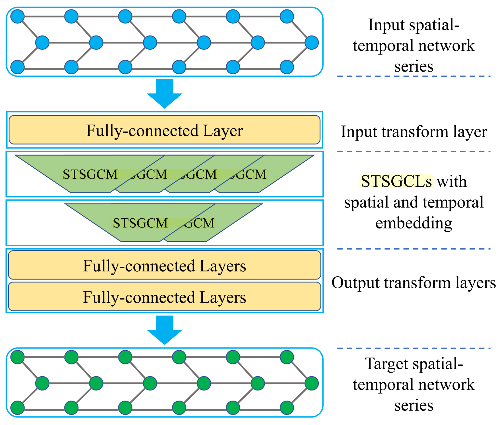 | (1) 本文主要解决以往时空图卷积块没有实现时空相关性同步捕获的问题。 (2) 作者提出局部时空图概念 (3) We propose a novel spatial-temporal graph convolutional. 作者提出了一种新的时空图卷积模块来直接同步捕获局部时空相关性，而不是单独使用不同类型的神经网络模块。 (4) 全局遮罩矩阵和时空嵌入矩阵也在一定程度上增强了模型对时空信息的捕获能力。 |

*C Song, Y Lin, [S Guo](https://scholar.google.com.hk/citations?user=3JsSBYsAAAAJ&hl=zh-CN&oi=sra), [H Wan](https://scholar.google.com.hk/citations?user=T5wVWIUAAAAJ&hl=zh-CN&oi=sra)*

------

 2019 

[1] **[Flow Prediction in Spatio-Temporal Networks Based on Multitask Deep Learning](./papers/2019/TKDE/MDL/MDL)** TKDE 2019. [note](./papers/2019/TKDE/MDL/note.md). 

| Models | Modules |                         Architecture                         | Highlights |
| :----: | :-----: | :----------------------------------------------------------: | :--------: |
|  MDL   |         |  |            |

  *[J Zhang](https://scholar.google.com.hk/citations?user=juUcdgYAAAAJ&hl=zh-CN&oi=sra), [Y Zheng](https://scholar.google.com.hk/citations?user=sQpMBqsAAAAJ&hl=zh-CN&oi=sra), [J Sun](https://scholar.google.com.hk/citations?user=GuZu8CoAAAAJ&hl=zh-CN&oi=sra), D Qi*

[2] **[UrbanFM: Inferring Fine-Grained Urban Flows](./papers/2019/KDD/UrbanFM)** SIGKDD 2019. [note](./papers/2019/KDD/UrbanFM/note.md).  [code](https://github.com/nnzhan/Graph-WaveNet)

| Models  | Modules |                         Architecture                         | Highlights |
| :-----: | :-----: | :----------------------------------------------------------: | :--------: |
| UrbanFM |         |  |            |

  *[Y Liang](https://scholar.google.com/citations?user=n9cODgcAAAAJ&hl=zh-CN&oi=sra), [K Ouyang](https://scholar.google.com/citations?user=CY6FH6YAAAAJ&hl=zh-CN&oi=sra), L Jing, [S Ruan](https://scholar.google.com/citations?user=oecbn38AAAAJ&hl=zh-CN&oi=sra)*

------

[3] **[Attention Based Spatial-Temporal Graph Convolutional Networks for Traffic Flow Forecasting](./papers/2019/AAAI/ATSGCN/ASTGCN)** AAAI 2019. [note](./papers/2019/AAAI/ATSGCN/note.md), [github](https://github.com/guoshnBJTU/ASTGCN-r-pytorch)

| Models |   Modules   |                    Architecture                     | conclusion                                                   |
| :----: | :---------: | :-------------------------------------------------: | :----------------------------------------------------------- |
| ASTGCN | SAtt, TAtt, | 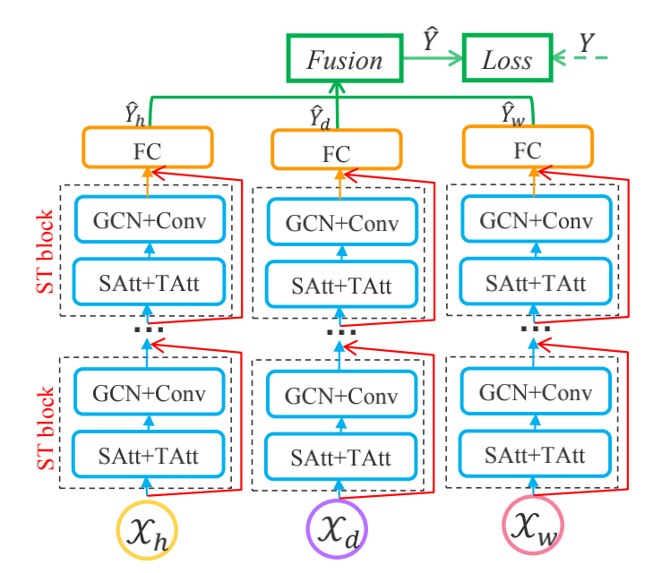 | This paper proposes a new spatial-temporal attention mechanism to effectively capture the dynamic spatial-temporal correlations in traffic data. and use the spatial-temporal convolution which simultaneously employs graph convolutions to capture the spatial patterns and common standard convolutions to describe the temporal features. |

*Shengnan Guo, Youfang Lin, Ning Feng, Chao Song, Huaiyu Wan*

---

 2018 

[1] **[Spatio-Temporal Graph Convolutional Networks: A Deep Learning Framework for Traffic Forecasting.](./papers/2018/IJCAI/STGCN)** IJCAI 2018. [note](./papers/2018/IJCAI/STGCN/note.md), [github](https://github.com/VeritasYin/STGCN_IJCAI-18).

| Models | Modules |                         Architecture                         | Highlights |
| :----: | :-----: | :----------------------------------------------------------: | :--------: |
| STGCN  |         |  |            |

  *Bing Yu, Haoteng Yin, Zhanxing Zhu*

------

 Other years 

[1] **[Deep Spatio-Temporal Residual Networks for Citywide Crowd Flows Prediction](./papers/2016/AAAI/ST-ResNet)** AAAI 2016. [note](./papers/2016/AAAI/ST-ResNet/note.md).

|  Models   | Modules |                         Architecture                         | Highlights |
| :-------: | :-----: | :----------------------------------------------------------: | :--------: |
| ST-ResNet |         | 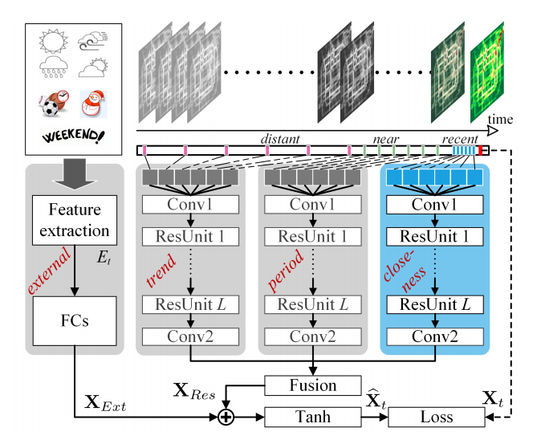 |            |

  *[J Zhang](https://scholar.google.com.hk/citations?user=juUcdgYAAAAJ&hl=zh-CN&oi=sra), [Y Zheng](https://scholar.google.com.hk/citations?user=sQpMBqsAAAAJ&hl=zh-CN&oi=sra), D Qi*

------

[2] **[Diffusion Convolutional Recurrent Neural Network*: *Data*-*Driven Traffic Forecasting](.\papers\2017\ICLR\DCRNN/DCRNN)** ICLR 2017. [note](.\papers\2017\ICLR\DCRNN/note.md), [github](https://github.com/liyaguang/DCRNN?utm_source=catalyzex.com).

| Models | Modules |                         Architecture                         | Highlights |
| :----: | :-----: | :----------------------------------------------------------: | :--------: |
| DCRNN  |         |  |            |

  *[Y Li](https://scholar.google.com.hk/citations?user=fv5TMfIAAAAJ&hl=zh-CN&oi=sra), [R Yu](https://scholar.google.com.hk/citations?user=4HTITaMAAAAJ&hl=zh-CN&oi=sra), [C Shahabi](https://scholar.google.com.hk/citations?user=jEdhxGMAAAAJ&hl=zh-CN&oi=sra), [Y Liu](https://scholar.google.com.hk/citations?user=UUKLPMYAAAAJ&hl=zh-CN&oi=sra)*

## [Demand Prediction](#content)

[1] **Taxi Demand Prediction Using Parallel Multi-Task Learning Model.** TITS 2020. [note](), [paper](https://ieeexplore.ieee.org/document/9172100)

| Models  |  Modules   |                      Architecture                      | conclusion                                                   |
| :-----: | :--------: | :----------------------------------------------------: | :----------------------------------------------------------- |
| pmlLSTM | Multi-Task | 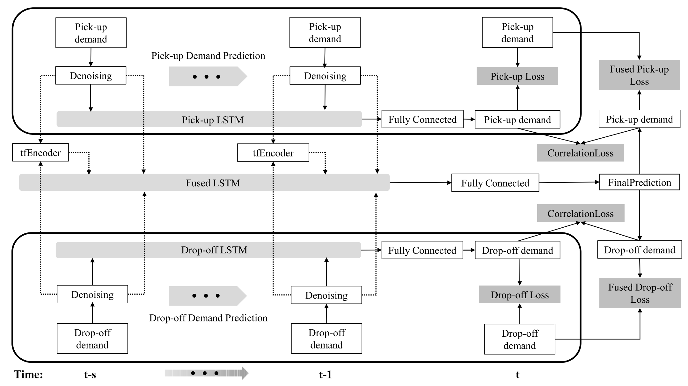 | This paper focus on the co-prediction of taxi pick-up and drop-off demands, and propose a parallel multi-task learning model, which can deal with shared features of multiple tasks simultaneously. In addition, this paper  design a novel taxi demand classifier to extract the time information hidden in the data, which embeds the time of a day feature into the forecasting model. |

*Chizhan Zhang, Fenghua Zhu, Xiao Wang, Leilei Sun, Haina Tang, Yisheng Lv*

---

[2] **Traffic Demand Prediction Based on Dynamic Transition Convolutional Neural Network.** TITS 2020. [note](), [paper](https://ieeexplore.ieee.org/abstract/document/8968739)

| Models | Modules |                   Architecture                   | conclusion                                                   |
| :----: | :-----: | :----------------------------------------------: | :----------------------------------------------------------- |
| DTCNN  | DGCGRU  | 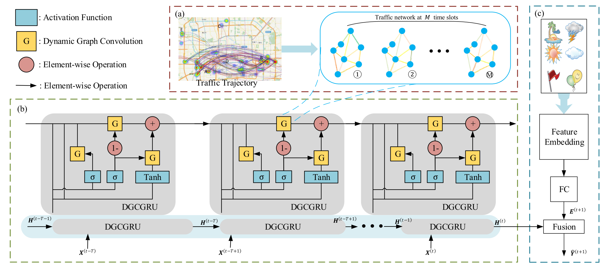 | This paper consists of three modules: 1) transition network construction, which encodes the discovered virtual stations as nodes, and transition flows between them as edges; 2) a dynamic transi- tion convolution unit, which captures the spatial distributions and temporal dynamics of traffic demands simultaneously; 3) a fusion module, which integrates the hidden states of historical traffic demands with environmental factors to predict the next-period traffic demands. |

*Bowen Du, Xiao Hu, Leilei Sun, Junming Liu, Yanan Qiao, Weifeng Lv*

---

 2019 

[1] **Origin-Destination Matrix Prediction via Graph Convolution: a New Perspective of Passenger Demand Modeling.** KDD 2019. [note](./papers/2019/KDD/GEML/note.md), [paper](https://dl.acm.org/doi/abs/10.1145/3292500.3330877)

  *Yuandong Wang, Hongzhi Yin, Hongxu Chen, Tianyu Wo, Jie Xu, Kai Zheng*

[2] **STG2Seq: Spatial-temporal Graph to Sequence Model for Multi-step Passenger Demand Forecasting.** IJCAI 2019.[note](./papers/2019/IJCAI/STG2Seq/note.md), [paper](https://arxiv.org/abs/1905.10069)

  *Lei Bai, Lina Yao , Salil.S Kanhere, Xianzhi Wang, Quan.Z Sheng*

---

 2018 

[1] **Deep Multi-View Spatial-Temporal Network for Taxi Demand Prediction.** AAAI 2018. [note](), [paper](https://arxiv.org/pdf/1802.08714.pdf)

  *Huaxiu Yao, Fei Wu, Jintao Ke, Xianfeng Tang, Yitian Jia, Siyu Lu, Pinghua Gong, Jieping Ye, Zhenhui Li*

## [Travel time or Arrive time Prediction](#content)

[1] **HetETA: Heterogeneous Information Network Embedding for Estimating Time of Arrival.** KDD 2020. [note](./papers/2020/KDD/HetETA/note.md), [paper](https://www.kdd.org/kdd2020/accepted-papers/view/heteta-heterogeneous-information-network-embedding-for-estimating-time-of-a), [github](https://github.com/didi/heteta)

| Models |    Modules     |                    Architecture                    | conclusion                                                   |
| :----: | :------------: | :------------------------------------------------: | :----------------------------------------------------------- |
| HetETA | GatedCNNs, GCN | 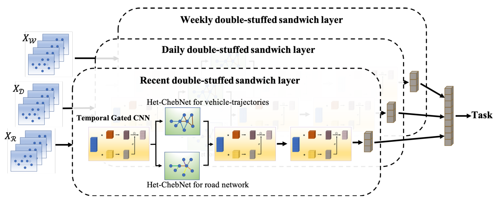 | In this paper, traffic structure is constructed by digging deeper semantic information of traffic network. HetETA combines gated convolution neural networks and graph neural networks to capture the correlations in spatiotemporal information. |

*Huiting Hong, Yucheng Lin, Xiaoqing Yang, Zang Li, Kun Fu, Zheng Wang, Xiaohu Qie, Jieping Ye*

---

[2] **CompactETA: A Fast Inference System for Travel Time Prediction.** KDD 2020. [note](./papers/2020/KDD/CompactETA/note.md), [paper](https://www.kdd.org/kdd2020/accepted-papers/view/compacteta-a-fast-inference-system-for-travel-time-prediction)

|   Models   |                   Modules                    |                         Architecture                         | conclusion                                                   |
| :--------: | :------------------------------------------: | :----------------------------------------------------------: | :----------------------------------------------------------- |
| CompactETA | Graph attention network, Positional encoding | 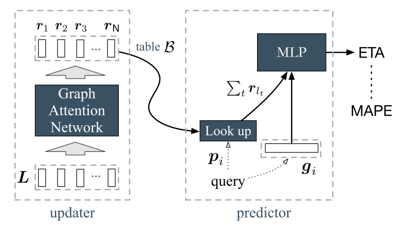 | This paper use a compact model for real-time inference. The inference model use high level link representations as input feature, which is learnt on road network graph by a graph attention network equipped with positional encoding. These representations capture the spatiotemporal dependency between roads, and further encode the sequential information of the travel route. |

*Kun Fu, Fanlin Meng, Jieping Ye, Zheng Wang*

---

 2019 

[1] **Spatiotemporal Multi-Graph Convolution Network for Ride-hailing Demand Forecasting.** AAAI 2019. [note](./papers/2019/AAAI/ST-MGCN/note.md), [paper](http://www-scf.usc.edu/~yaguang/papers/aaai19_multi_graph_convolution.pdf).

  *Xu Geng, Yaguang Li, Leye Wang, Lingyu Zhang, Qiang Yang, Jieping Ye, Yan Liu*

---

 2018 

## [Speed Prediction](#content)

 2019 

[1] **[Graph WaveNet for Deep Spatial-Temporal Graph Modeling.](./papers/2019/IJCAI/GWN)** IJCAI 2019. [note](./papers/2019/IJCAI/GWN/note.md). [paper](https://arxiv.org/abs/1906.00121), [github](https://github.com/nnzhan/Graph-WaveNet)

| Models |              Modules               |                Architecture                 | conclusion                                                   |
| :----: | :--------------------------------: | :-----------------------------------------: | :----------------------------------------------------------- |
|  GWN   | GCN with adaptive Matrix,Gated TCN | 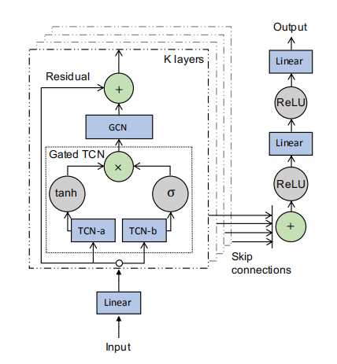 | This paper proposes a diffusion convolution formula with an adaptive adjacency matrix on the basis of DCRNN. During the training process, it also emphasizes that the structure of the graph changes dynamically. The paper uses two embedding vectors to dynamically learn the graph structure. Causal convolution is used to model time dependence. The overall structure of the model is similar to WaveNet. |

*Zonghan Wu, Shirui Pan, Guodong Long, Jing Jiang, Chengqi Zhang*

## 

# [Datasets](#content)

[1] GAIA Open Dataset: [link](https://outreach.didichuxing.com/research/opendata/)

[2] 智慧足迹: [link](http://www.smartsteps.com/)

## [Sensor data](#content)

[1] UK traffic flow datasets: [link](https://www.gov.uk/)

[2] Illinois traffic flow datasets: [link](http://www.travelmidwest.com/)

[3] PeMS: [link](http://pems.dot.ca.gov/), [Baidu Netdisk](https://pan.baidu.com/s/1c3NNV7nGnDylFJ9tBYUF0g) password:jutw | [PeMS Guide](https://github.com/Knowledge-Precipitation-Tribe/Urban-computing-papers/blob/master/PEMS.md)

## [Trajectory data](#content)

[1] Chengdu: [link](https://outreach.didichuxing.com/app-vue/TTItrajectory?id=1001)

[2] Xian: [link](https://outreach.didichuxing.com/app-vue/TTItrajectory?id=1001)

## [Others](#content)

[1] Weather and events data: [link](https://www.wunderground.com/)

[2] Weather and climate data: [link](https://www.ncdc.noaa.gov/data-access)

[3] NSW POI data: [link](https://sdi.nsw.gov.au/catalog/search/resource/details.page?uuid=%7BC41F6FE5-1C56-4556-%209EC6-EC9BD7094BBB%7D)

[4] Road network data: [link](http://networkrepository.com/road.php)

[5] NYC OpenData: [link](https://opendata.cityofnewyork.us/)

[6] METR-LA: [link](http://geohub.lacity.org/datasets/traffic-data?geometry=-119.170%2C33.900%2C-117.193%2C34.298), [Baidu Netdisk](https://pan.baidu.com/s/1g9yxZMDVf9nI0eN-ixeiPQ) password:xsz5

[7] TaxiBJ: [link](https://github.com/TolicWang/DeepST/tree/master/data/TaxiBJ), [Baidu Netdisk](https://pan.baidu.com/s/1aoi7gEkFQFn2MTYlGuc7Iw) password:sg4n

[8] BikeNYC: [link](https://www.citibikenyc.com/system-data), [Baidu Netdisk](https://pan.baidu.com/s/1SdSPWu5c761H3e8XjtzuaA) password:lmwj

[9] NYC-Taxi: [link](https://www1.nyc.gov/site/tlc/about/tlc-trip-record-data.page), [Baidu Netdisk](https://pan.baidu.com/s/1W2UV-xiDG_wbM9tuPvfrsA) password:022y

[10] NYC-Bike: [link](https://www.citibikenyc.com/system-data)

[11] San Francisco taxi: [link](https://crawdad.org/)

[12] Chicago bike: [link](https://www.divvybikes.com/system-data)

[13] BikeDC: [link](https://www.capitalbikeshare.com/system-data)

# [Experts](#content)

(排名不分先后)

[1] Yu Zheng: [link](http://urban-computing.com/yuzheng)

[2] Yanhua Li: [link](http://users.wpi.edu/~yli15/index.html)

[3] Xun Zhou: [link](https://www.biz.uiowa.edu/faculty/xzhou/)

[4] YaGuang Li: [link](http://www-scf.usc.edu/~yaguang/)

[5] Zhenhui Jessie Li: [link](https://faculty.ist.psu.edu/jessieli/Site/index.html)

[6] David S. Rosenblum: [link](https://www.comp.nus.edu.sg/~david/)

[7] Huaiyu Wan: [link](http://faculty.bjtu.edu.cn/8793/)

[8] Junbo Zhang: [link](https://zhangjunbo.org/)

[9] Shining Xiang:[link](https://scholar.google.com/citations?hl=zh-CN&user=0ggsACEAAAAJ)

# Contributors

<a href="https://github.com/SuperSupeng"></img></a> <a href="https://github.com/Sylvia822"></img></a> <a href="https://github.com/Neoyanghc"></img></a>

## LICENSE

本作品采用<a href="http://creativecommons.org/licenses/by-nc-sa/4.0/" rel="nofollow">知识共享署名-非商业性使用-相同方式共享 4.0 国际许可协议</a>进行许可。