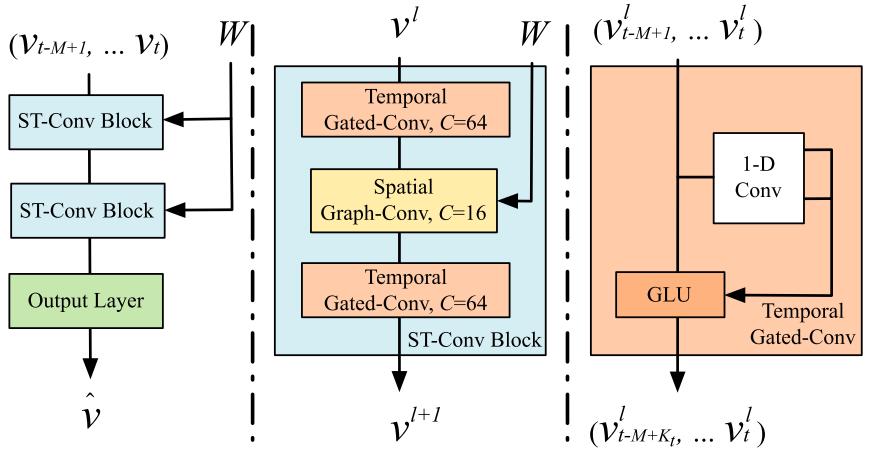

# Summary

| Models |    Modules    |       Architecture        | conclusion                                                   |
| :----- | :-----------: | :-----------------------: | :----------------------------------------------------------- |
| STGCN  | GCN,Gated CNN |  | This paper uses GCN to model spatial dependence, temporal dependence modeling uses causal convolution, and uses the gating mechanism GLU. The bottleneck strategy is used in the structure to achieve feature compression. This paper is also the first application of GCN in the field of transportation. |